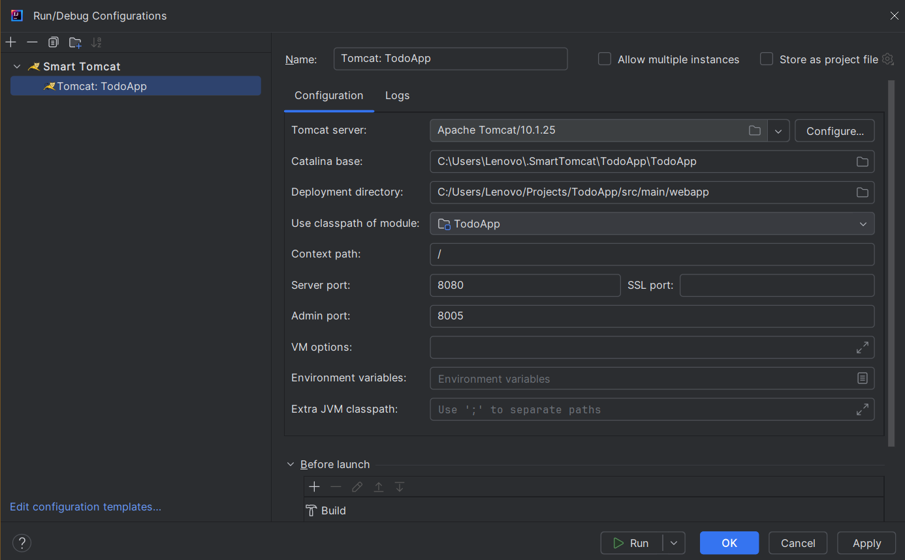

# Todo App

## Description

This project is a Java-based web application designed to manage tasks efficiently. The application includes features such as user authentication and authorization, CRUD operations for managing tasks, and logging functionality. Passwords are securely stored in the database as hashes instead of plain text for enhanced security.

---

## Tech Stack

The project is developed using the following technologies:

- **Java**: Core programming language for backend logic.
- **JSP (JavaServer Pages)**: For dynamic HTML rendering.
- **Servlets**: To handle HTTP requests and responses.
- **HTML, CSS, JavaScript**: For frontend development.
- **Apache Tomcat**: As the web server.
- **PostgreSQL Database**: For data storage.
- **Maven**: For project build and dependency management.
- **JDBC**: For database interaction.
- **Lombok**: To reduce boilerplate code in Java.
- **Logback & SLF4J**: For logging.
- **Database Connection Pooling**: For efficient resource management.

---

## Features

- User Authentication and Authorization.
- Passwords securely stored as hashes in the database.
- Basic CRUD operations for tasks.
- Logging implemented using Logback and SLF4J.
- Database connection pooling for improved performance.
- User-friendly interface with dynamic functionality.

---

## Installation and Setup

Follow these steps to run the project on your local machine:

### Prerequisites

1. Install **Java Development Kit (JDK)** (version 17 or higher).
2. Install **Apache Tomcat** (version 10 or higher).
3. Install **PostgreSQL**.
4. Install **Maven** (latest version).
5. Clone this repository to your local machine.

### Steps

1. **Clone the Repository**

   ```bash
   git clone https://github.com/mLastovsky/Todo-App.git
   cd Todo-App
   ```

2. **Configure Database**

   - Create a file `src/main/resources/application.properties`.
   - Set the database URL, username, password, and pool size to match your local setup.

   ```properties
   db.url=jdbc:postgres://localhost:5432/todo_app_repository
   db.username=your-username
   db.password=your-password
   db.pool.size=your-db-pool-size
   ```

   - Run the SQL schema file located in `scripts/CreateDbScript.sql` to initialize the database:

   ```bash
   psql -U your-username -d postgres -f scripts/CreateDbScript.sql
   ```

3. **Build the Project**

   Use Maven to build the project:

   ```bash
   mvn clean install
   ```

### 4. **Run the Application via IntelliJ IDEA**

- Open the project in IntelliJ IDEA.
- Go to **Run | Edit Configurations**.
- Add a new configuration of type **Tomcat Server | Local**.
- Set it up as shown in the image below.



- Save the configuration.
- Run the application by selecting the configuration and pressing the green run button.

5. **Access the Application**

   - Open your browser and go to:
   ```
   http://localhost:8080/
   ```

---

## Screenshots

### Login Page
The login interface for users to access their accounts.


### Registration Page
The registration page for creating a new account.


### Dashboard
The main dashboard displaying the user's todos.


### Edit Todo
The interface for editing an existing todo.


### Database Schema
Visual representation of the database structure.


